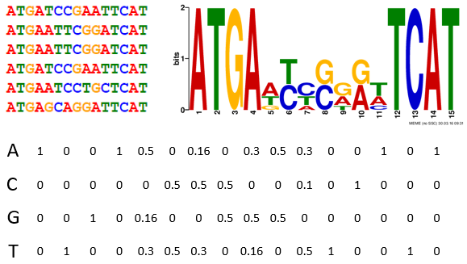

# **MEFIM-FindR** #
**version 0.01**
## **Authors** ##

Floris Menninga: Main programmer Tool  
Ruben van Dam: Main Tool intergration programmer  
Tai Vo: Main back-end programmer  
Jarno Duiker: Main Front-end programmer 

## **Instalation Guide** ##
To use this website and python script, the MEME suite is needed. 
It can be compiled from source as described below. 
Execute the folowing commands:

 
Download the meme-x.x.x.tar.gz file from the following website:  
https://meme-suite.org/meme/doc/download.html  
tar zxf meme-5.5.5.tar.gz # to decompress the files  
         <code> cd meme-5.5.5 </code> # to move to the directory   </code>
         <code> ./configure --prefix=$HOME/meme --enable-build-libxml2 --enable-build-libxslt </code> # to configure for the os  
         <code>  make </code> # to compile  
         <code> make install </code> # to install  
To add this tool to the PATH variable:  
export PATH=$HOME/meme/bin:$HOME/meme/libexec/meme-5.5.5:$PATH  

## **Commandline Example:** ##

meme <INPUT_FILE_LOCATION> -dna -oc <OUTPUT_LOCATION> -time 14400 -mod zoops -nmotifs 3 -minw 6 -maxw 50 -objfun classic -revcomp -markov_order 0   
The flags can be changed, for example: -dna can be -rna or -protein and -nmotifs 3 can be changed to any arbitrary number of motifs that the program should find (it stops looking when the number is 
reached)  

## **System Requirements:** ##

Any python compatible x86 or x64 computer with the MEME Suite installed.  
RAM requirements depend on the size of the input files (Motif file and the sequence that needs to be scanned)   

 
.
.

 ## **Purpose of our website and tool** 
MemeSuite is a collection of tools with the encompassing goal of transcription factor binding site recognition.
To recognize TF(transcription factor) binding sites, one can use the FIMO tool. FIMO is used to scan for the presence of known transcription factor motifs, a list of motivs has to be given in order to search for them.

The other tool that we implemented on the website is MEME, this tool is used to find novel transcription factor binding sites, for this, the user has to
input a multi-fasta sequence with the sequences that the tool should use to find motifs, a motif is a short nucleotide patter that consists of 4 to 20 nucleotides.  The sequence of this motif is not always the same but there are nucleotides at every position in this short sequence that have a higher likelyhood of occuring at that place. The chance of what nucleotide occurs at what position can be displayed using a SequenceLogo. See the example SequenceLogo below. 

 
The

## **Contact** ##

 For feedback, bugs and other problems. Contact us!  
Tai Vo git: MoonCake98  
Jarno Duiker git: azzipxonraj  
Ruben van Dam git: RCvanDam  
Floris Menninga git: Fl-ris 

## **Refrences on 29/02/2024** ##
**TOOLS**

MEME Suite. (z.d.). https://meme-suite.org/meme/doc/overview.html

