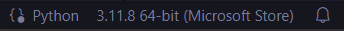

# Instructions

## 1.0: activating the virtual environment
---
(this manner of activating the venv can be done from any unix terminal like gitbash, just the linux terminal and powershell)
you can also use vscode ran in administrator mode, with powershell instance for your terminal 

navigate in the terminal to the directory:

>`/app_prototype`

after that paste and run in the commandline:
>`venv/scripts/activate`

if all went well you should see something like this in front of your filepath:
>`(venv)`

## 1.1.: UnauthorizedAccess error(optional)
---
if you get an error something like this:

>`   + venv/scripts/activate`
>`   + ~~~~~~~~~~~~~~~~~~~~~`
>`       + CategoryInfo          : SecurityError: (:) [], PSSecurityException`
>`       + FullyQualifiedErrorId : UnauthorizedAccess`

you type in this command:

>`set-executionpolicy remotesigned`

*if this succeeds it should simply execute without output,*
*so other than it switching to an empty line you won't see anything*

repeat 1.0 after this

## 1.2.: Venv activation via VSCode (optional)
---

(this is an alternative way of activating a venv specific to vscode)

you're gonna want to open the app.py file in vscode and in the botom right you should see something like this:

>

click on it and at the top of the screen you should see a select interpreter dropdown menu apear.
you have to manually navigate to:
>`app_prototype\venv\Scripts\python.exe`

how you do this is up to you. you can copy this directly into the open text field,
or ou can click on "enter interpreter path" and do it via your file explorer app.

## 2.0: running the server
---
before you run the server you also have to switch python interpreters.
this is to make sure you can utilise the modules preinstalled in the venv.

now that you have entered the virtual environment we can run the server as it includes all python dependencies.

if you are still in this the directory:
>`app_prototype`

you can simply run:
>`flask run`

If this for some reason doesn't work you can also run the file directly by pasting this into the commandline:
>`python3.12.exe app.py`